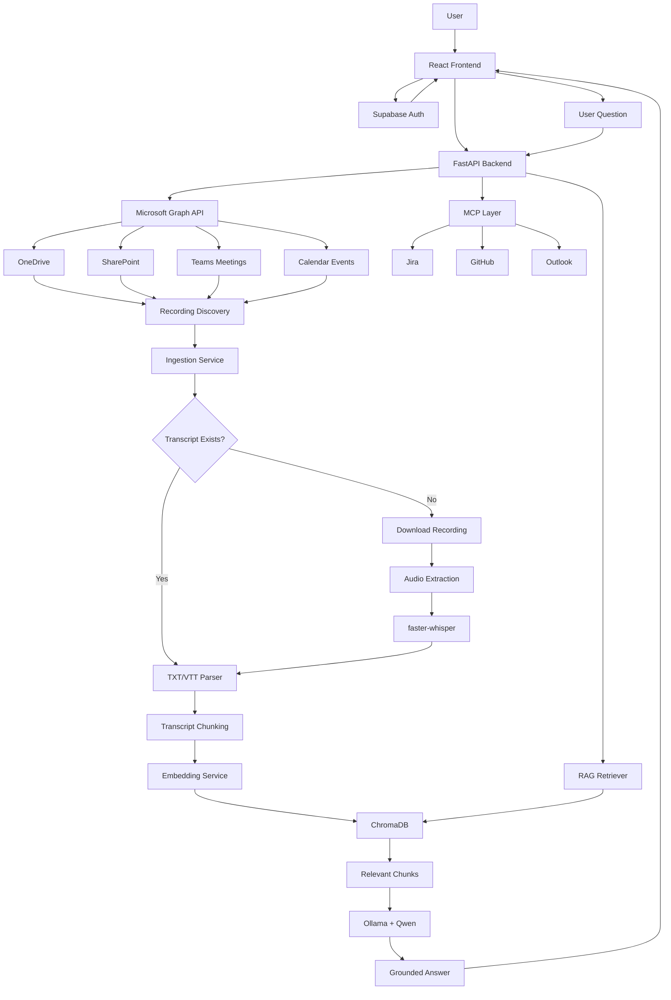

# MeetVault AI

MeetVault AI is an AI-powered meeting intelligence platform that turns Microsoft Teams, SharePoint, and OneDrive meeting recordings into searchable knowledge. It ingests accessible meeting assets, generates transcripts when needed, stores transcript embeddings in ChromaDB, and answers user questions through a grounded RAG chat experience.

The current implementation is focused on the working product flow, ingestion pipeline, vector storage, RAG retrieval, and MCP-ready tool integrations. Deployment details are intentionally not included yet.

## Core Features

- Microsoft login through Supabase Auth.
- Microsoft Graph access using the signed-in user's provider token.
- SharePoint, OneDrive, Teams, and calendar-aware recording discovery.
- Workspace sync for accessible meeting recordings and transcript files.
- Transcript parsing for TXT and VTT files.
- Recording transcription fallback for MP4, WebM, M4A, MP3, and WAV files.
- Audio extraction with PyAV/FFmpeg-style media handling.
- Speech-to-text transcription with faster-whisper.
- Transcript normalization into speaker and timestamp turns.
- Chunking with overlap and metadata preservation.
- Local embeddings stored in ChromaDB.
- RAG search over stored transcript chunks.
- Local SLM answer generation through Ollama and Qwen.
- Chat-style frontend with history, settings, sync status, and topic chips.
- Supabase-backed chat history support.
- MCP layer for future and current external tool connections.
- Jira MCP integration for live ticket context in RAG answers.
- GitHub OAuth MCP scaffolding.
- Outlook connector scaffolding.
- Runtime ChromaDB files are ignored and not committed to Git.

## Tech Stack

### Frontend

- React
- Vite
- Supabase JavaScript client
- CSS-based custom UI

### Backend

- FastAPI
- Uvicorn
- Microsoft Graph API
- ChromaDB
- Sentence Transformers
- faster-whisper
- PyAV
- Ollama
- Qwen SLM
- Python dotenv configuration

### Storage

- Supabase for authentication and chat history.
- ChromaDB for vector storage.
- Local temporary backend files for recording downloads during transcription.

## High-Level Architecture



## Methodology

### 1. Authentication

The user signs in with Microsoft through Supabase Auth. Supabase manages the session and exposes the Microsoft provider token to the frontend. The frontend sends this token to the backend when calling Microsoft Graph-powered APIs.

The backend validates whether the token is a Microsoft Graph token before calling Microsoft Graph. This prevents Supabase JWTs from being accidentally used against Graph endpoints.

### 2. Recording Discovery

The backend discovers accessible meeting assets through Microsoft Graph. It checks the signed-in user's Microsoft workspace for recent recordings and transcript-like files from:

- OneDrive
- SharePoint
- Teams meeting recordings
- Calendar-related meeting context
- Shared content available to the user

The discovery layer looks for supported transcript and media formats, deduplicates assets, and skips files that are already indexed.

Supported transcript files:

- `.txt`
- `.vtt`

Supported recording/audio files:

- `.mp4`
- `.webm`
- `.m4a`
- `.mp3`
- `.wav`

### 3. Ingestion Pipeline

When an asset is found, the ingestion service decides how to process it:

- If the asset is a transcript file, the backend reads and normalizes it directly.
- If the asset is a recording, the backend downloads it temporarily, extracts audio, and transcribes it.
- If the file has no valid audio stream, it is ignored as non-transcribable instead of blocking the full sync.
- If a recording was already embedded, it is reused instead of duplicated.

Each ingestion item is tracked with status values such as:

- `PROCESSING`
- `EMBEDDED`
- `SKIPPED`
- `FAILED`
- `NO_TRANSCRIPT`

The workspace sync status is surfaced in the frontend so the user can see whether ingestion is running, complete, skipped, or failed.

### 4. Transcript Generation

For recording files, MeetVault uses a local transcription pipeline:

1. Download the recording to a temporary backend file.
2. Validate that the downloaded file is real media and not an HTML/error response.
3. Extract audio using PyAV media processing.
4. Convert audio to a transcription-friendly WAV format.
5. Transcribe with faster-whisper.
6. Normalize transcript turns with speaker labels and timestamps.

This allows MeetVault to work even when a native Microsoft transcript is not available.

### 5. Chunking and Metadata

Normalized transcripts are split into overlapping chunks. Each chunk keeps metadata needed for retrieval, auditability, and future UI filtering:

- Meeting ID
- Meeting title
- Source type
- Chunk index
- Speaker range
- Start timestamp
- End timestamp
- Turn count

Source types include Microsoft/SharePoint/OneDrive-backed values such as:

- `graph_transcript`
- `graph_recording_transcription`
- `onedrive_transcript`
- `onedrive_video_transcription`
- `sharepoint_transcript`
- `sharepoint_recording_transcription`

### 6. Embedding and Vector Storage

Each transcript chunk is converted into an embedding and stored in ChromaDB.

Default Chroma configuration:

- DB path: `./chroma_db`
- Collection: `meetvault_transcripts`
- Default embedding model: `all-MiniLM-L6-v2`

ChromaDB stores:

- Chunk text
- Vector embedding
- Metadata
- Stable chunk ID

Runtime ChromaDB files are ignored by Git because they are generated data and should not be pushed to the repository.

### 7. RAG Query Flow

When the user asks a question:

1. The frontend sends the query to the FastAPI backend.
2. The backend embeds the query.
3. ChromaDB returns candidate transcript chunks.
4. The retriever filters out legacy or non-Microsoft data.
5. Matching chunks are reranked using semantic similarity, meeting title overlap, source type, and query relevance.
6. The top grounded chunks are passed to the answer generator.
7. Ollama runs the Qwen SLM locally.
8. The frontend displays a grounded answer in chat format.

If no relevant Microsoft-backed chunks are found, the app returns a clear no-context response instead of hallucinating.

### 8. Local SLM Answer Generation

MeetVault uses Ollama with a Qwen model for local answer generation.

Default configuration:

- `RAG_MODEL=qwen2.5:7b`
- `OLLAMA_HOST=http://127.0.0.1:11434`

The answer generation layer includes:

- Prompt grounding
- Safety middleware
- Output sanitization
- Fallback behavior if the local model is unavailable

### 9. MCP Layer

The MCP layer allows MeetVault to connect external tools to the meeting intelligence workflow.

Current MCP-related capabilities:

- MCP route registration in FastAPI.
- MCP manager abstraction.
- Jira connection support.
- Jira task retrieval.
- GitHub OAuth scaffolding.
- Outlook connector scaffolding.
- Frontend MCP panel and service layer.

The RAG pipeline can inject live Jira context when a user asks about tickets, tasks, issues, or sprints. This lets meeting knowledge and live tool data appear together in a grounded answer.

Planned MCP use cases:

- Notify users when ingestion completes.
- Pull calendar context into answers.
- Connect Teams or Slack actions.
- Create or update Jira tickets from meeting action items.
- Send follow-up summaries through email or Teams.

### 10. Frontend Experience

The frontend is designed as a chat-first workspace search experience.

Main UI capabilities:

- Microsoft sign-in.
- Workspace sync trigger.
- Sync and vector-store status display.
- Search bar for meeting questions.
- Chat-style answer view.
- Conversation history.
- Settings panel.
- MCP panel.
- Topic chips for common meeting queries.

Topic chips are optional. A user can click a topic to start with that context, or type directly into the search box.

## Project Structure

```text
MeetVault-AI/
  backend/
    app/
      api/
        graph_routes.py
        mcp_routes.py
      mcp/
        github/
        jira/
        outlook/
        mcp_manager.py
      rag/
        ingest.py
        retrieve.py
        llm.py
        prompts.py
        router.py
      services/
        chroma_service.py
        embedding_service.py
        ingestion_service.py
        meeting_service.py
        onedrive_service.py
        recording_service.py
        transcript_service.py
    tests/
    requirements.txt

  frontend/
    src/
      components/
        mcp/
      lib/
      services/
      App.jsx
      App.css

  scripts/
  docs/
  .env.example
  README.md
```

## Environment Variables

Use `.env.example` as the reference for required configuration.

Important variables:

```env
MS_CLIENT_ID=
MS_CLIENT_SECRET=
MS_TENANT_ID=
GRAPH_BASE_URL=https://graph.microsoft.com/v1.0

VITE_API_BASE_URL=http://localhost:8000
VITE_SUPABASE_URL=
VITE_SUPABASE_PUBLISHABLE_KEY=

CHROMA_DB_PATH=./chroma_db
CHROMA_COLLECTION_NAME=meetvault_transcripts

EMBEDDING_MODEL_NAME=all-MiniLM-L6-v2

WHISPER_MODEL_SIZE=base
WHISPER_DEVICE=cpu
WHISPER_COMPUTE_TYPE=int8

RAG_MODEL=qwen2.5:7b
OLLAMA_HOST=http://127.0.0.1:11434
```

## Local Setup

### Backend

```powershell
cd backend
python -m venv venv
.\venv\Scripts\activate
pip install -r requirements.txt
python -m uvicorn app.main:app --reload --host 127.0.0.1 --port 8000
```

### Frontend

```powershell
cd frontend
npm install
npm run dev -- --host 127.0.0.1 --port 5173
```

### Ollama

Install Ollama, then pull the configured model:

```powershell
ollama pull qwen2.5:7b
ollama run qwen2.5:7b
```

If `ollama` is not available in PATH, run it using the installed executable path or add the Ollama install directory to the Windows PATH.

## Testing

### Backend Tests

```powershell
cd backend
.\venv\Scripts\activate
python -m unittest discover -s tests -v
```

### Frontend Build

```powershell
cd frontend
npm run build
```

### Manual Product Test

1. Start the backend.
2. Start the frontend.
3. Sign in with Microsoft.
4. Click `Sync workspace now`.
5. Wait while recordings/transcripts are processed.
6. Check that ChromaDB shows live chunks in the UI.
7. Ask a question related to an indexed recording.
8. Confirm the answer is grounded in retrieved transcript chunks.

Useful backend checks:

```powershell
Invoke-WebRequest -UseBasicParsing "http://127.0.0.1:8000/vector-store/status" | Select-Object -ExpandProperty Content
Invoke-WebRequest -UseBasicParsing "http://127.0.0.1:8000/ingestion/workspace-status" | Select-Object -ExpandProperty Content
Invoke-WebRequest -UseBasicParsing "http://127.0.0.1:8000/ingestion/status" | Select-Object -ExpandProperty Content
```

## Current Limitations

- Microsoft Graph access depends on tenant permissions and admin consent.
- Some Teams/SharePoint recordings may not contain an audio stream and are skipped.
- Large recordings may take several minutes to download, transcribe, chunk, embed, and store.
- ChromaDB is currently local runtime storage.
- Polling/webhook-based automatic ingestion is planned but not finalized.
- MCP tool coverage is still being expanded.

## Future Improvements

- Microsoft Graph webhook support for new recording events.
- Background polling worker for periodic workspace sync.
- Job queue for long-running ingestion tasks.
- MCP notifications after ingestion completes.
- More MCP tools for email, calendar, Teams, Slack, and ticketing workflows.
- More advanced RAG evaluation and answer quality scoring.
- User-specific vector-store filtering and access isolation.
- Better source previews and topic summaries in the UI.
